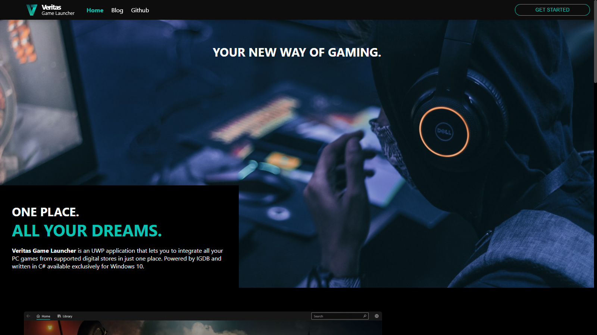

## Introdution

Official source code for [veritas.marck7jr.dev](https://veritas.marck7jr.dev). This website is designed to house and promote the progress of *Veritas Game Launcher*, a game launcher, currently in development, written in C# and UWP for Windows 10.

All trademarks and copyright-written content found on this website belong to their respective owners. The *Veritas Game Launcher* team is in no way affiliated with any mentioned entity.

## Licensing
This website uses the GNU General Public License Version 2.0 (June 1991). According to the license, you are welcome to use the website and its source code for any purpose, but distributing the websites' files requires that the source code be released and attribution given. For more details on how the GNU General Public License system works, please refer to [GNU.org](https://GNU.org)

## Deployment

This is a [Next.js](https://nextjs.org/) project bootstrapped with [`create-next-app`](https://github.com/vercel/next.js/tree/canary/packages/create-next-app).

### Getting Started

First, run the development server:

```bash
npm run dev
# or
yarn dev
```

Open [http://localhost:3000](http://localhost:3000) with your browser to see the result.

### Learn More

To learn more about Next.js, take a look at the following resources:

- [Next.js Documentation](https://nextjs.org/docs) - learn about Next.js features and API.
- [Learn Next.js](https://nextjs.org/learn) - an interactive Next.js tutorial.

You can check out [the Next.js GitHub repository](https://github.com/vercel/next.js/) - your feedback and contributions are welcome!